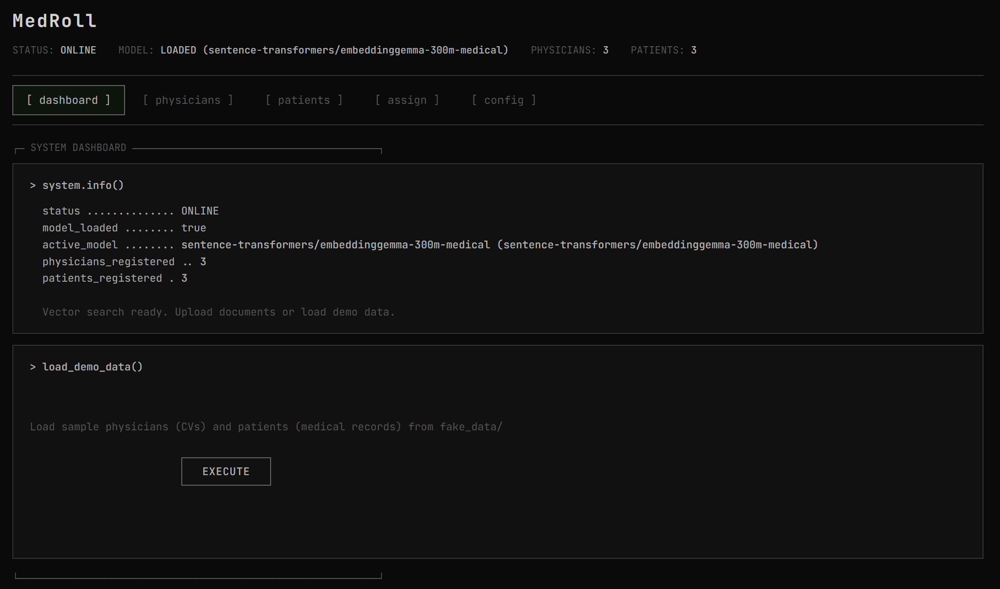
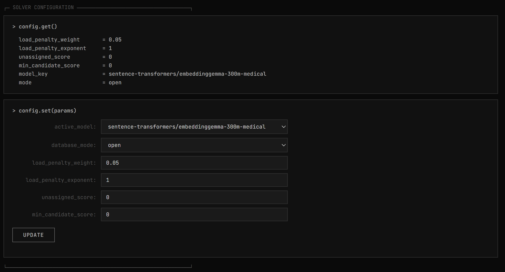
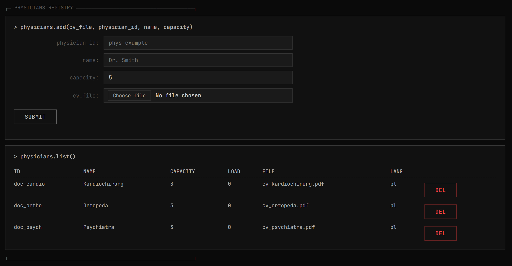
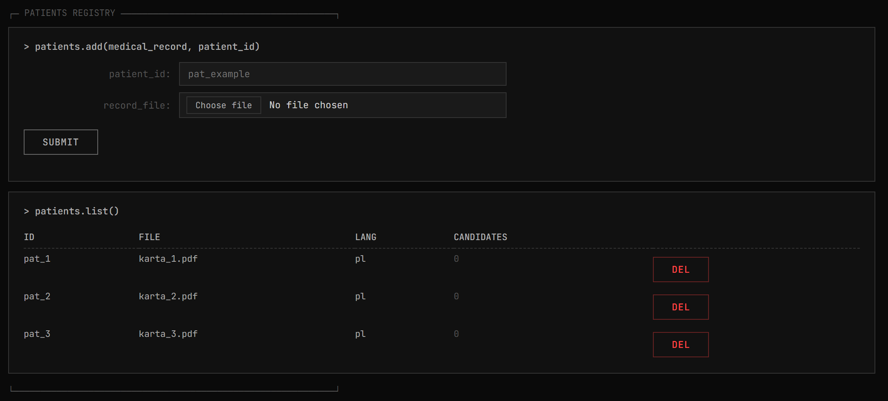
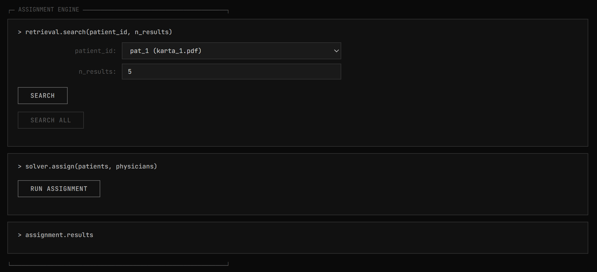

# MedRoll - Patient-Physician Assignment System
## Table of Contents
- [Introduction](#introduction)
- [Installation and Usage](#installation-and-usage)
- [About](#about)
- [Features](#features)
  - [Configuration](#configuration)
  - [Physicians and Patients Registry](#physicians-and-patients-registry)
  - [Retrieval & Vector Search](#retrieval--vector-search)
  - [Assignment Solver](#assignment-solver)
- [License](#license)

## Introduction
Python-based web application that models optimal patient-physician assignments using vector search and the Hungarian algorithm.

Project realized by:
- Adrian Mikoda [[adrianmikoda]](https://github.com/adrianmikoda)
- Mateusz Kursa [[Kursant321]](https://github.com/Kursant321)
- Mikołaj Gaweł [[Maikonroonie]](https://github.com/Maikonroonie)
- Patrycja Piasecka [[PatiPiasecka]](https://github.com/PatiPiasecka)



## Installation and Usage
### Prerequisites
- **Python**: version 3.10 or higher is recommended.
- **Hardware**: Running the large embedding model (`nvidia/llama-embed-nemotron-8b`) requires a dedicated GPU or high RAM/VRAM. For standard local CPU setups, we recommend using smaller models.

### Getting Started
1. Clone the repository and navigate to the project directory:
```sh
git clone https://github.com/adrianmikoda/medroll.git
cd medroll
```
2. Create and activate a Python virtual environment:
```sh
python -m venv venv
source venv/bin/activate
```
3. Install the required dependencies:
```sh
pip install -r requirements.txt
```
4. Run the FastAPI application using Uvicorn:
```sh
python -m uvicorn main:app --port 8000
```
5. Open your browser and navigate to:
```
http://127.0.0.1:8000
```

## About
MedRoll solves the patient-to-physician assignment problem. It reads physician CVs and patient medical charts, computes vector embeddings, and uses semantic matching to find good fits. A linear assignment solver then finds the best global matching — respecting physician capacity limits and penalizing uneven workloads to avoid burnout.

**Key Features:**
- Reads CVs and medical records from `.pdf` and `.docx` files (via PyMuPDF and python-docx)
- Embeds and indexes documents in LanceDB, using cosine similarity for matching
- Uses the Hungarian algorithm (`linear_sum_assignment` from SciPy) to solve assignments globally
- Configuration (penalty weights, model choice, etc.) can be changed on the fly
- Terminal-style web UI for managing registries and running assignments

## Features
### Configuration
Most of the assignment parameters can be tuned directly from the interface:

- **Active Model (Sentence Transformers)**: Choose from several supported embedding models:
  - `sentence-transformers/embeddinggemma-300m-medical`
  - `nvidia/llama-embed-nemotron-8b`
  - `all-MiniLM-L6-v2`

> [!NOTE]
> Running the 8B Nemotron model locally requires high VRAM/GPU resources. For standard CPUs/laptops, please use the lighter models.

- **Database Mode**: Set to `overwrite` (wipes the database table, clears loaded registries and patient caches/assignments to start fresh) or `open` (uses existing LanceDB index).
- **Load Penalty Weight & Exponent**: Controls the dynamic penalty applied to physicians as their workload fills up.
- **Unassigned Patient Thresholds**:
  - `unassigned_score`: Baseline utility score for leaving a patient unassigned.
  - `min_candidate_score`: Minimum similarity score required to qualify as a physician candidate.



### Physicians and Patients Registry
You can add physicians and patients by uploading their documents:

- **Physicians**: Provide a unique `physician_id`, full name, capacity (maximum patients), and a resume (PDF/DOCX). The text is extracted and stored in the vector database.

  

- **Patients**: Provide a unique `patient_id` and their medical chart/record. Their data is cached for assignment retrieval.

  

### Retrieval & Vector Search
Before running an assignment, you can search for candidates for a single patient or all patients:
- **`retrieval.search`**: Queries the vector database with patient symptoms/medical history to fetch the top `N` matching physicians along with their cosine similarity scores.

### Assignment Solver
The core solver handles assignments globally using one of two strategies:
- **Incremental**: matches new patients to remaining open physician slots, leaving existing assignments untouched.
- **Rebalance**: rebuilds all assignments from scratch to maximize the overall semantic score and reduce load imbalance.



## License
This project is licensed under the MIT License. See the [LICENSE](LICENSE) file for details.
